# Photographic Video Rendering of Procedurally Generated Cities with _pix2pix_

Lingdong Huang [@LingDong-](https://github.com/LingDong-), Hizal Çelik [@DerTarchin](https://github.com/DerTarchin), Shouvik Mani [@shouvikmani](https://github.com/shouvikmani)

###### March 2018

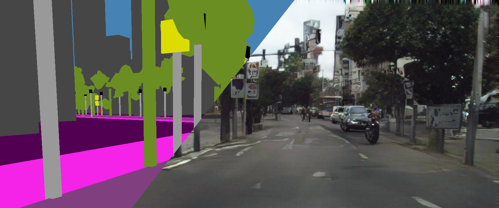
___

# Introduction

In this paper, we explore the possibilities of producing photo-realistic videos from procedurally generated semantic segmentation images. By training machine learning learning algorithms such as pix2pix [1], pix2pixHD [2] on labeled street photographs from the cityscapes [3] data set, realistic photographs can be hallucinated solely based on entirely fictional semantic segmentation image.

Interested in the intersection between art and machine learning, we believe due to the limited information presented to the neural network, the computer will have much “creative freedom” in its hallucination of cityscape images. Thus we attempt to question the role of humans and computers in the art making process, as well as to push the boundaries for computer graphic effects.

Our project mainly contains three parts, the first involves procedurally generating an appropriate spatial-temporal representation of a city, while the second involves training and generating the rendering via pix2pix and pix2pixHD frame by frame. As a final step, we combine the generated frames into a video piece.

A [comparison video](https://youtu.be/uuQZWXrr3JE) and a [technical video](https://youtu.be/Bzl7ggemIYc) are produced. Our final results can be found [here](https://youtu.be/-P_Sfl4e1xo), and our source code can be found [here](https://github.com/DerTarchin/Pix2Pix-Generative-Cities).

# Procedural City Generation

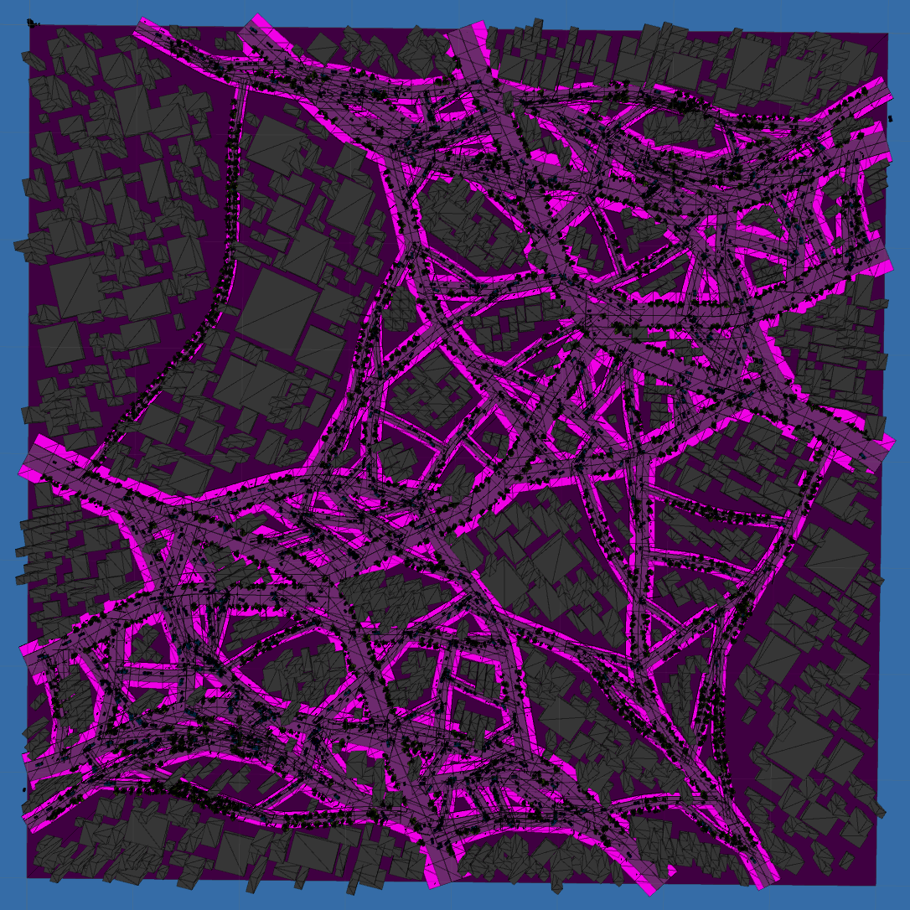

## Motivation

In order to use _pix2pix_ to translate a procedurally generated city into photo-realistic renderings of a city, we first need to generate a procedurally generated city. Observing that _pix2pix_ has decent ability to hallucinate details based on shapes, we designed our generative algorithms as follows.

## Techniques

### Types of Cities

We came up with two possible ways of procedurally generating a city. The first is a road-first method: first produce tree-fractal-like roads and then generate buildings along the roads. The second is a block-first method: Consider the whole map as a single large block, and recursively divide them into smaller blocks with roads. We decided to experiment with the latter for this project.

Our implementation first considers the city from a 2D perspective, similar to a (top-down) plan. Afterwards, shapes are extruded to render a 3D city.

### Splitting Blocks

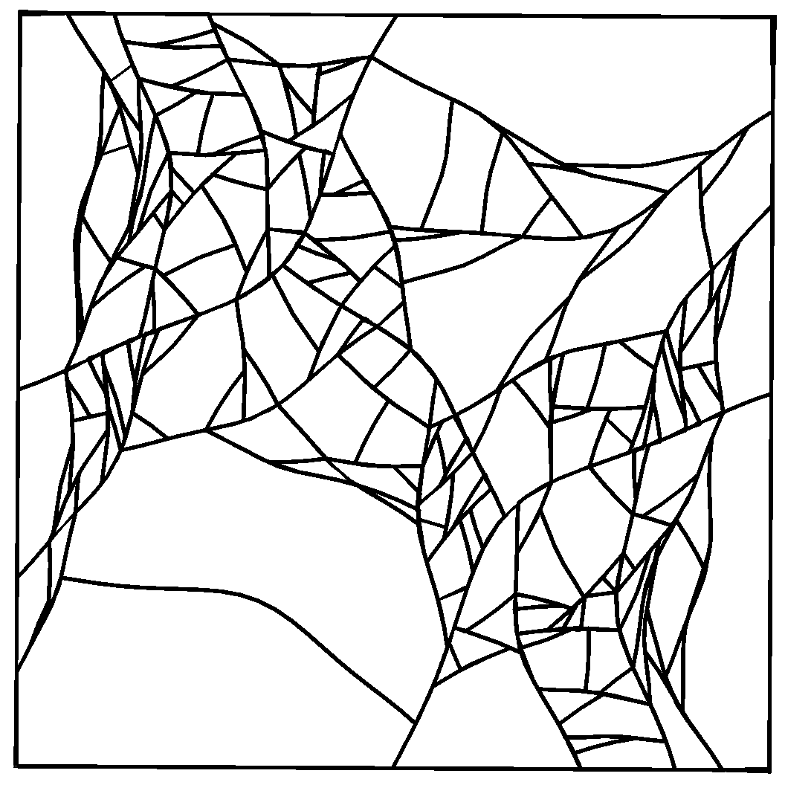

Each city block can be viewed as a polygon, and the division of blocks using roads can be considered as drawing a poly-line that passes through it, yielding two smaller polygon blocks.

Roads in real cities are often curved, and blocks sometimes have irregular shapes. But instead of being completely random blobs, these structures are more comparable to rectangles and triangles with wiggly edges. To capture these important features, we decided to store the blocks as lists of "borders", with each border containing a list of points, and the roads as single borders. 

During the recursive division step, it is desirable that the blocks are split optimally, that is, number of sliver and tiny pieces shall be minimized. While more sophisticated algorithms exist (e.g. comparing perimeter to area), we decided to use an approximation which makes a cut passing through the mid-points of two longest borders of the block. It is observed that this gives both speed and nice variations.

### Paving roads

To reproduce the somewhat curved shape of roads in real life, we applied a Perlin Noise to offset points along a straight line. Different sampling give different "wiggliness".

### Planning Buildings

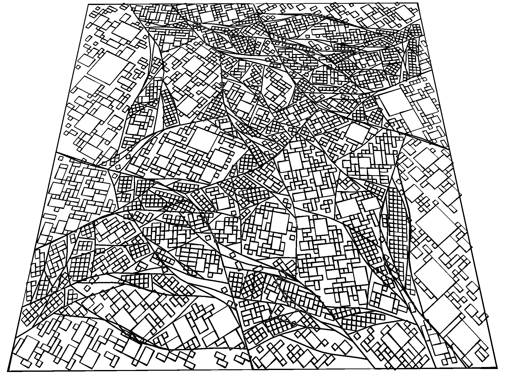

After the blocks are determined, they need to be further divided into smaller sections - buildings. A relatively simple algorithm is as follows: 

- First, a grid is laid upon the block of interest, with a random rotation. 
- Then, all the squares on the grid that lays outside the block are deleted. 
- Finally, the remaining squares are randomly combined to make larger rectangles, which represent the buildings. The maximum and minimum size of the buildings can be dependent on the size of the block.

### Building the City

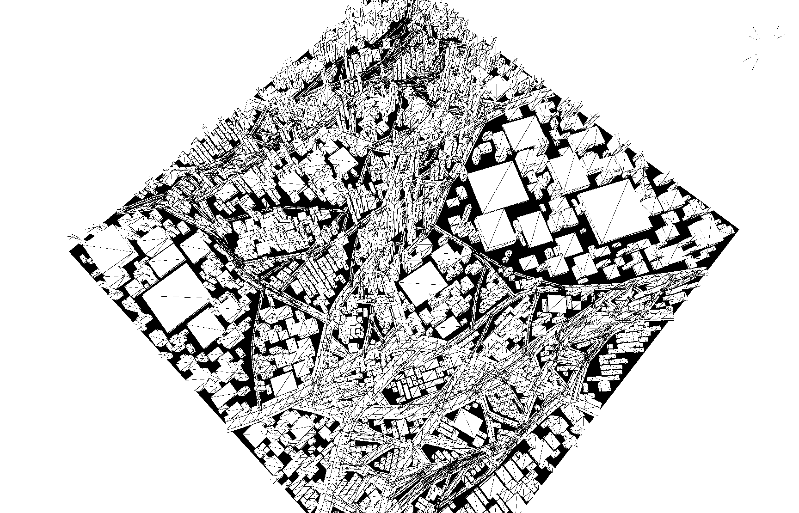

Once the 2D plan of roads, buildings and blocks is obtained, a rough city model can be generated by extruding the shapes. The buildings near center of the map, which is probably downtown, are made skinnier and taller, and buildings near edge of the map, which is probably suburban area, are made larger and flatter. The roads that are generated by the first couple recursions are wider, representing the main streets, while roads generated by the last few recursions are much narrower, representing small paths and shortcuts.

Miscellaneous structures such as street lights, traffic lights, street signs are generated using groups of cubes with some variants, and are populated along the roads. Some simple logic determines their location and appearance.

### Growing Trees

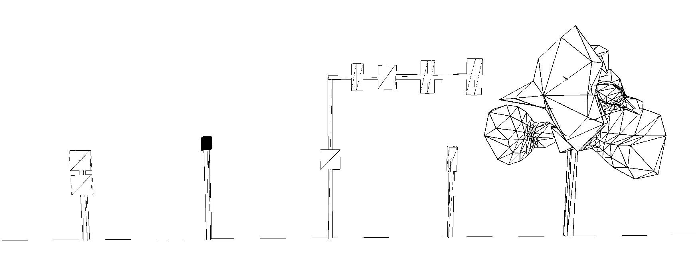

While cubes are suffice for most stuff on the road, more organic structures such as trees requires more complicated meshes. So a procedural blob generator which applies some noise to the sphere function is written. Each vertex on the sphere is randomly offset from the center, with the magnitude determined by Perlin Noise with spatial information of the vertex as input. The tree is then composed of a bunch of these blobs.

The same blob method is also used to generate mesh for humans (one blob for head, one blob for body).

### Adding Life

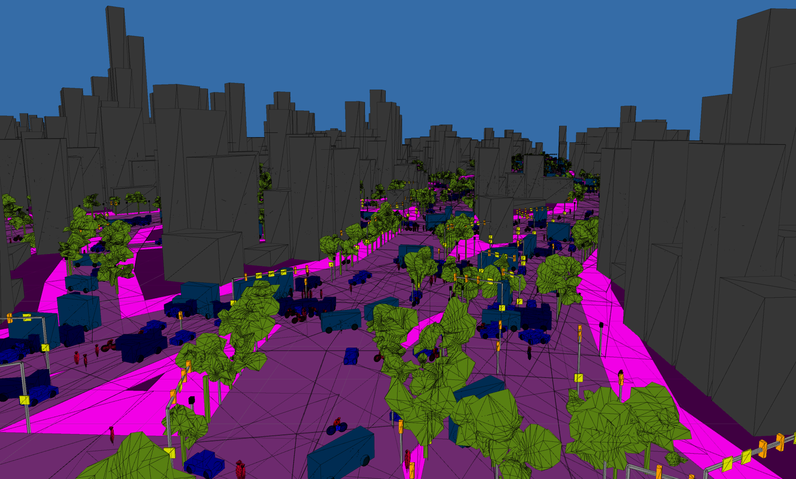

Vehicles, people and other moving things are added to prevent the city from looking spooky and abandoned.

Some design of artificial intelligence is required for this to work: cars needs to know where the roads are (instead of drifting through buildings), and things shouldn't bump into each other (too often).

Complex traffic rules can be probably implemented, but for the sake of this project, We decided to condense them into a handful of most essential axioms:

- The ultimate goal of any entity is to reach a destination (i.e. a location on the map).
- At each time step, the entity can either move forward or backward along the road, or turn into another road if it's at a crossroad. The decision is informed by its desire to reach the destination.
- If two entities bump into each other, one of them will be stunned for a couple seconds (allowing the other to pass) and start moving again.
- Traffic keeps to the right.

The result is a (rather amusing) primitive form of traffic system. While many traffic accidents are effectively prevented, and vehicles and people generally get to go where they intend to go, traffic jams and serial car accidents occur frequently at busy crossroads. Sometimes they run into a Klotski puzzle situation, and the road becomes so blocked nobody can pass through, accumulating more and more stuck cars over time.

## Possible Improvements

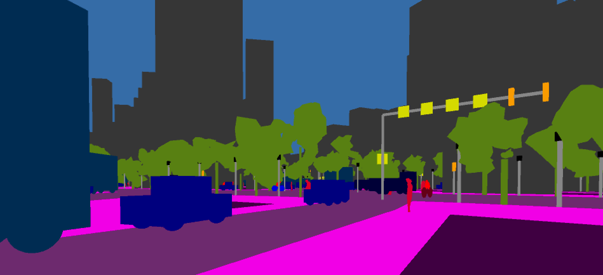

While a relatively complete city can be generated using the methods described, We considered a couple of potential future improvements:

- Overpasses can be built to produce a more spectacular city;
- Make traffic lights actually functional;
- More terrain variants instead of just flat;
- More types of miscellaneous objects on the sidewalk. (e.g. carts, umbrellas, open air tables)
- More lanes for cars (instead of just 2 for every road)

# pix2pix Experimentation, Training and Testing
## Introduction
We experimented with multiple methods and variables in the training and testing processes in order to understand a bit more how the pix2pix network thinks and works, and how we can get the best results from it. We discovered that rendering a single image well often did not mean it would translate the same level of quality into generating video frames. For our experimentations, we used both regular pix2pix-tensorflow and a lesser known pix2pixHD (which was even more finicky in it's own way).

## Experiments

### Color Correction
The original training set is based on footage from a mercedes being driven around in various German cities, resulting in a rather dim, downcast imageset. In an experiment to see how editing the footage to increase brightness, contrast and saturation would result in different pix2pix models, we processed the dataset twice and compared the original with two different levels of color correction.

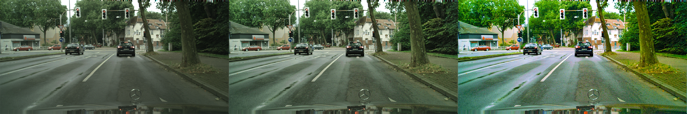

After training a seperate model for a short period of time each (approx 40-50 epochs), we decided the most saturated image yielded far too fake of an image, almost an eye sore. The original dataset, which resulted in images that felt like Hong Kong, was still too gray and monotone for enjoyable results. The final models were trained on a dataset consisting of the middle image type, which is "some" color correction.

### Training Dataset Resolution
We compared models we trained on datasets consisting of a resolution of 512x256 pixels and the full size of 2048x1024 pixels, as well as compared with the pretrained model available on pix2pix's website. We couldn't decide between the two models we trained, in the end, and used both in our final renders. We did conclude that both our models were better than the pretrained model available online. Please note that our larger dataset consisted of unprocessed (original) images while the smaller dataset was based on our color corrected dataset. Some differences may have arised from that fact.

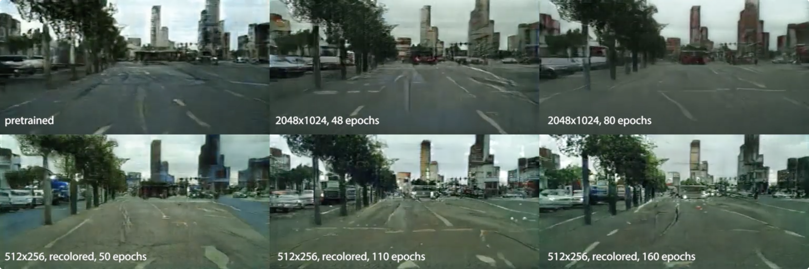

### Varying Iterations (epochs)
Somewhat due to the limited time available per session on our main choice of cloud computing platform, Google Colab, we saved checkpoints at various stages of training, most often at around 40-60 epochs per 11-hour training sessions. 

This resulted in the most confusion and discussion regarding what looked best. When originally comparing generated still images as tests, sometimes the lower-iterations resulted in more "realistic" renders, and other times higher iteration counts did. This flip-flop trend continued once we began generating images frame-by-frame and compiling videos. Although higher iteration checkpoints contained more detail, they seemed to flicker more often between frames compared to lower iteration checkpoints. Our final renders used the model trained on full size images for 80 epochs, and a model trained on smaller, color corrected images at 160 epochs.

### Flickering, Static Textures, Artifacts
While testing our renders we noticed that the higher the framerate, the more likely flickering would occur, as well as a phenomenon where a building's texture would remain still on the screen relative to frame edges, even while the camera moved or panned. By reducing the framerate, these effects seemed to minimize, so our final renders generally are set to 10fps. We also decided that, possibly in the future, by rendering buildings as seperate images and compiling them later we may achieve a more seperated, realistic render of buildings rather than one large gray blob on screen.

#### De-flickering using linear interpolation
A problem we persistently faced throughout our experimentation was that of flickering video. Because our generated video was individual pix2pix frames strung together into a video, slight inconsistencies between the frames seemed to cause a flickering effect in the video. The flickering was nauseating and distracted the viewer from our artwork.

To see this effect, note the slight discrepancies between the following consecutive frames in the video.

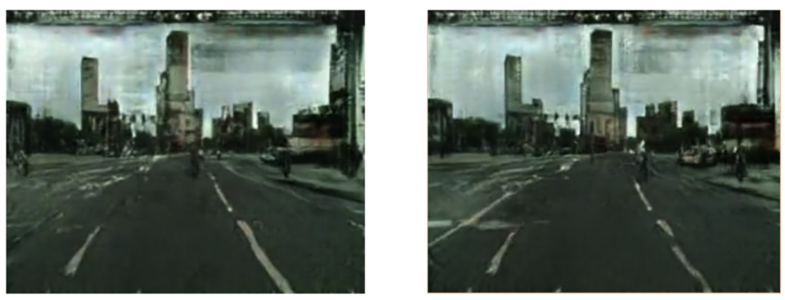

We tried to resolve this issue by doing linear interpolation between two consecutive frames and then inserting those interpolated frames between the original frames. Our intuition was that by finding and inserting intermediate frames, we could “fill in the gap” between two inconsistent frames and smoothen the transition from one frame to another.

Linear interpolation is the process of finding intermediate points along a line. For example, if we had a line defined by two points A and D, linear interpolation could be used to find the intermediate points B and C.

For two points x1 and x2, intermediate points x′ can be calculated as a simple weighted average, where:

We can vary the weight _θ_ to place emphasis on either endpoint. In the image/video domain, linear interpolation involves applying this weighted average strategy to two frames in the video. Specifically, we interpolated four intermediate frames for every two consecutive frames in the video.

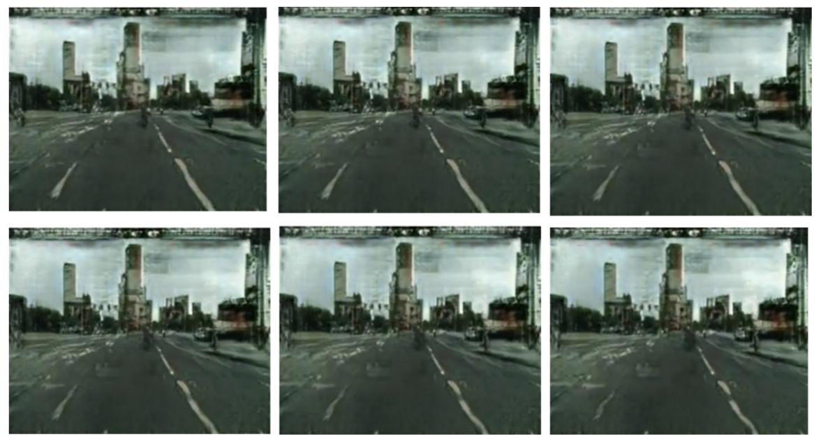

While this strategy seemed promising at first, it did not ultimately give us any significant improvements. Adding four frames between each consecutive frame did make the video appear more stable, but naturally, it made the video much slower. We tried increasing the frame rate to account for this lag, but doing so brought back the flickering effect. In the end, we decided that linear interpolation was not a viable approach to reduce the flickering effect.

## Issues with Training

### Local Training
We ran into multiple issues while training, often leading to loss of 12+ hours of training, multiple times. The first issue was that Mac's are no longer supported for GPU training, which means it's CPU only and highly inefficient. A MacBook Pro Retina 15" was used for 20 hours (two nights) and only got as far as 50 epochs in total.

### Google Colab
Google Colab was our go-to training method afterwards because AWS wasn't working for some members, and because Colab is far easier to use and easy to colaborate with. Unfortunately, the problems continued where two 12-hour sessions were lost. The first time was lost because we were unable to extract our trained checkpoints, repeatedly running into connection errors while attempting to download it from the browser using `file.download(file)`, even when breaking down to small parts. (the second loss was due to wrong alarm clock setting, which passed the 12-hour time limit of Colab and the instance shut down).

Apparently, any direct uploading or downloading through the `file` library results in connection issues if it takes longer than a few seconds for the process to complete. The solution was to either use Google Drive or other online storage means to store datasets or previous checkpoints, and use PyDrive or python to download using those URLs directly to Colab. As for uploading upon training completion, the only way is directly uploading to Drive. Multiple Piazza posts were made about these issues.

An unexpected benefit to this is that transfering files between Colab instances and Drive is extremely fast, sometimes up to 8GB a minute! This must be due to the fact that they are both Google products and probably share Google servers.

### pix2pixHD

Since a pre-trained checkpoint for cityscapes is provided by the authors of pix2pixHD, we were able to set up testing with pix2pixHD pretty quickly without needing to train it first. However, oddly enough, the model only worked for test images directly from the cityscapes dataset, while no matter what other original images were fed in, broken, glitchy outputs were produced. Eventually we tracked down the problem: due to the fact that all images in the cityscapes dataset have a black “rectification border” around the label images, it is very likely that a training bias was developed during NVDIA’s training process. Threfore, without the black border, pix2pixHD refuse to recognize our inputs as “proper” cityscapes, and respond by spitting out gibberish back at us. We confirmed this hypothesis by removing the black borders in the default test images, producing broken results, and adding the black borders to our own input images, producing fine results.

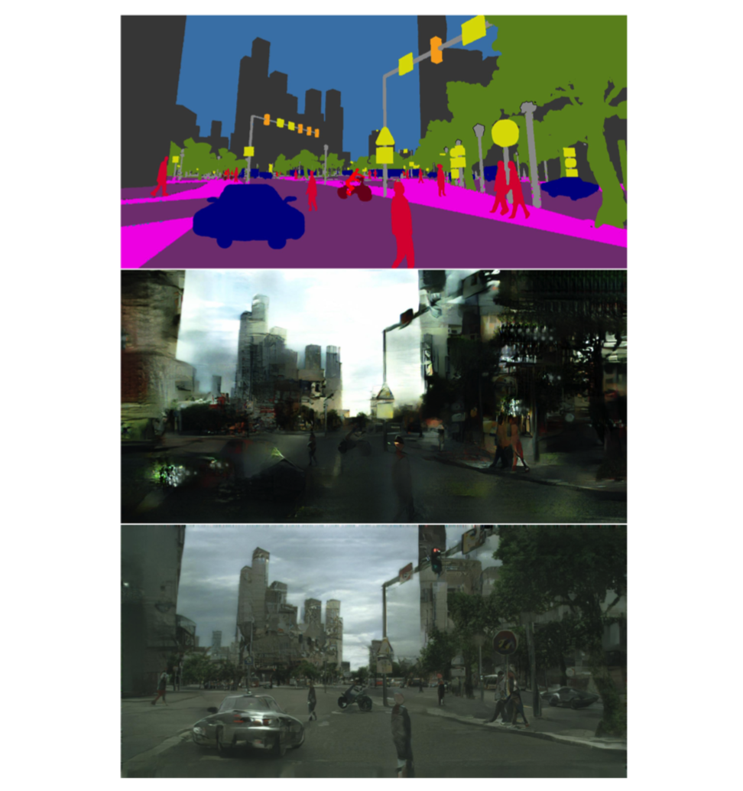

Another problem we faced was converting the input images to an encoding acceptable by pix2pixHD. pix2pixHD takes in a label map, where label ids (0-35) are used as luminosity of a given pixel. Since generally, for gray-scale images, pixels can have values ranging from 0 (black) to 255 (white), as one can imagine, with all the pixels assigned values 0 to 35, any image will look very dark, almost pitch black to naked human eyes. To make things worse, tiny errors can have devastating results. For example, “sky” has label id 23 while “person” has label id 24. Therefore, even if the pixel values of an image is off by only 1 (which is not uncommon for most compressed images), we may receive an image where the sky is filled with human flesh.

The input images we initially had are frames (RGB colored according to cityscapes dataset color coding specs) extracted from video recordings of our generated city. These are extensively compressed by the video encoder, and few pixels manage to retain the correct color. We approached the problem with a number of methods:

- The naive method calculates the Euclidean distance between the color of every pixel and each of the 35 standard colors, and assign them to the id with shortest distance.
- An improved version stores the most popular colors and their correspond- ing ID’s in a data structure to reduce the number of calls to Euclidean distance.
- Using a k-means implementation, we can divide all the pixels into k=35 sets, and assign ID’s accordingly.

The second approach was chosen since it takes around same time per image as the third when input image has low quality, while outperforming all others when the input image is already crisp.

# Results

[Source Code](https://github.com/DerTarchin/Pix2Pix-Generative-Ciites)

In our final submissions, we have a few final renders. Using the same footage, we created one render using the 80-epoch pix2pix model trained on full-scale images, one using the 160-epoch pix2pix model trained on 512x256 size images, and one using pix2pixHD algorithm. We color corrected the final output of the HD render to remove the greenish hues and low contrast, making it even more realistic. And finally, we created a new render of a “tour through the city,” in the form of a timelapse generated with Microsoft Hyperlapse Pro.

[Comparison Video](https://youtu.be/uuQZWXrr3JE)

[Technical Video](https://youtu.be/Bzl7ggemIYc)

[Final Results](https://youtu.be/-P_Sfl4e1xo)

# Conclusion
We consider this project a success in many ways. We convincingly generated “dream-like” (pix2pix) or semi-realistic (pix2pixHD), or perhaps “artistic” renderings of a completely procedurally generated cityscape. There are plenty of improvements that could be made, both in terms of the mesh detail in the generated city, and for tweaking the training of networks (and using new networks as they become available). pix2pixHD is relatively new but is quite promising, as the algorithm differs greatly from it’s pix2pix “parent,” solving many issues at once such as static textures, flickering and “blurry” images. There are also a growing number of datasets to train with, including ones making use of creative practices such as generating labels from the game GTAV by intercepting the video card. As these technologies advance, the generated imagery will become more realistic as well.

From our project, there are plenty of potential applications for this. The largest potential application is real-time texturing of a video game world, rather than having artists pre-texture everything. Our generated city allows the user to walk through it in first-person view, which is just a small step away from being an actual video game. Other iterations of this project potentially could include such real-time texturing.

# Resources

[pix2pix-tensorflow](https://github.com/affinelayer/pix2pix-tensorflow)

[pix2pixHD](https://github.com/NVIDIA/pix2pixHD)

[Cityscapes Dataset](https://www.cityscapes-dataset.com)

# References

[1] P. Isola, J.-Y. Zhu, T. Zhou, and A. A. Efros, “Image-to-image translation with conditional adversarial networks,” _CVPR_, 2017.

[2] T.-C. Wang, M.-Y. Liu, J.-Y. Zhu, A. Tao, J. Kautz, and B. Catanzaro, “High-resolution image synthesis and semantic manipulation with conditional gans,” _arXiv preprint arXiv:1711.11585_, 2017.

[3] M. Cordts, M. Omran, S. Ramos, T. Rehfeld, M. Enzweiler, R. Benenson, U. Franke, S. Roth, and B. Schiele, “The cityscapes dataset for semantic urban scene understanding,” in _Proc. of the IEEE Conference on Computer Vision and Pattern Recognition (CVPR)_, 2016.

