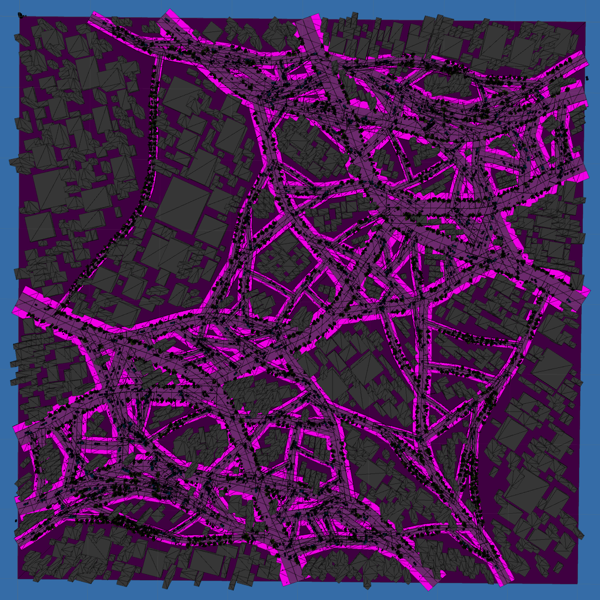
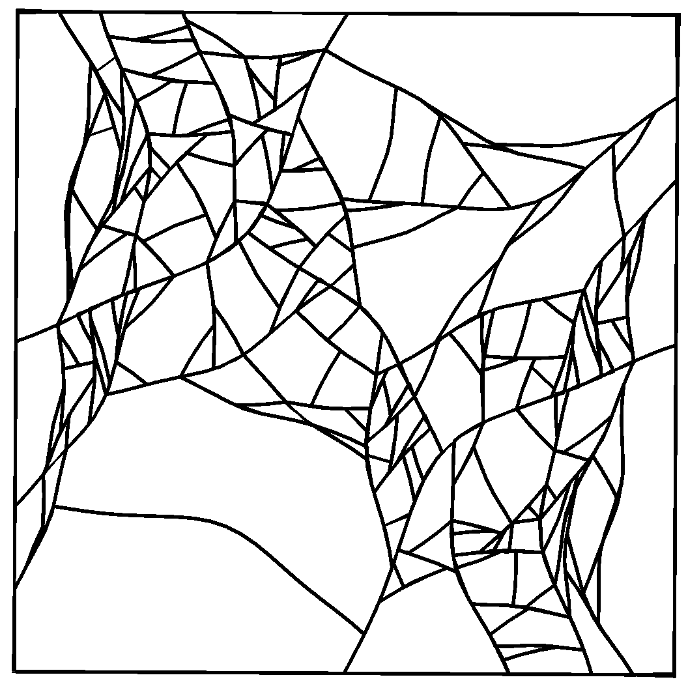
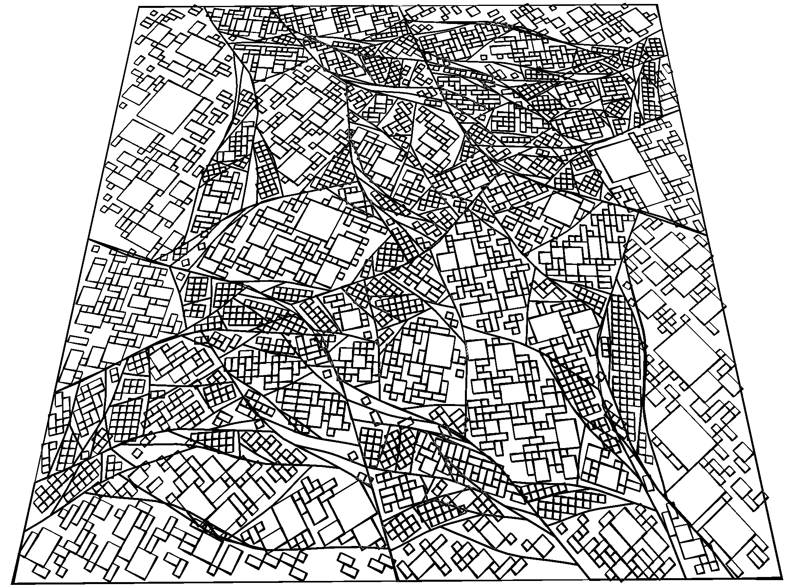
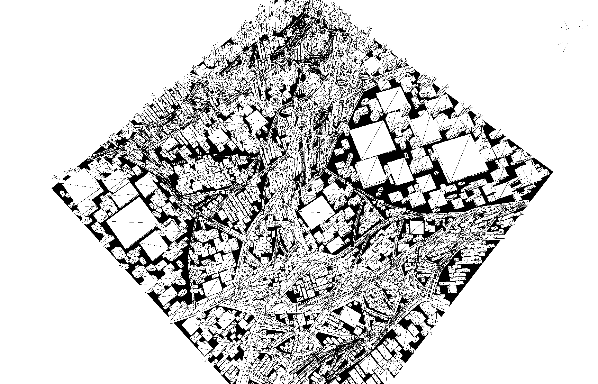
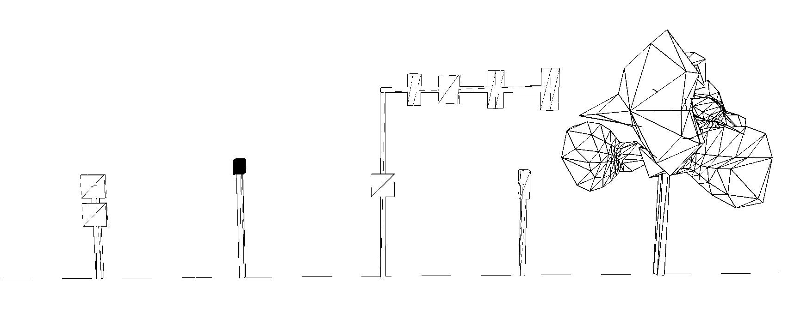
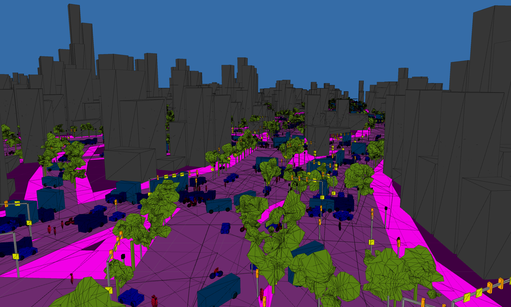
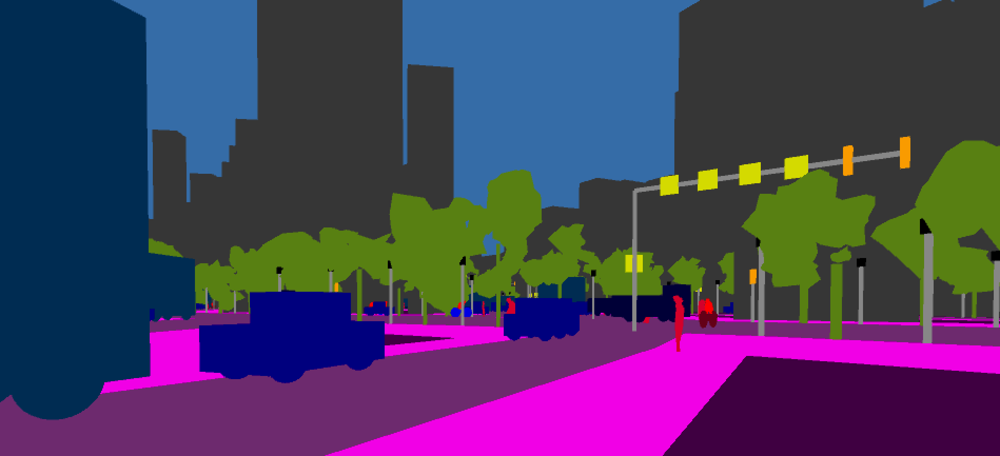

# Procedural City Generation

## Motivation

In order to use _pix2pix_ to translate a procedurally generated city into photo-realistic renderings of a city, we first need to generate a procedurally generated city. Observing that _pix2pix_ has decent ability to hallucinate details based on shapes, we designed our generative algorithms as follows.

## Techniques

### Types of Cities

We came up with two possible ways of procedurally generating a city. The first is a road-first method: first produce tree-fractal-like roads and then generate buildings along the roads. The second is a block-first method: Consider the whole map as a single large block, and recursively divide them into smaller blocks with roads. We decided to experiment with the latter for this project.

Our implementation first considers the city from a 2D perspective, similar to a (top-down) plan. Afterwards, shapes are extruded to render a 3D city.

### Splitting Blocks

Each city block can be viewed as a polygon, and the division of blocks using roads can be considered as drawing a poly-line that passes through it, yielding two smaller polygon blocks.

Roads in real cities are often curved, and blocks sometimes have irregular shapes. But instead of being completely random blobs, these structures are more comparable to rectangles and triangles with wiggly edges. To capture these important features, we decided to store the blocks as lists of "borders", with each border containing a list of points, and the roads as single borders. 

During the recursive division step, it is desirable that the blocks are split optimally, that is, number of sliver and tiny pieces shall be minimized. While more sophisticated algorithms exist (e.g. comparing perimeter to area), we decided to use an approximation which makes a cut passing through the mid-points of two longest borders of the block. It is observed that this gives both speed and nice variations.

### Paving roads

To reproduce the somewhat curved shape of roads in real life, we applied a Perlin Noise to offset points along a straight line. Different sampling give different "wiggliness".

### Planning Buildings

After the blocks are determined, they need to be further divided into smaller sections - buildings. A relatively simple algorithm is as follows: 

- First, a grid is laid upon the block of interest, with a random rotation. 
- Then, all the squares on the grid that lays outside the block are deleted. 
- Finally, the remaining squares are randomly combined to make larger rectangles, which represent the buildings. The maximum and minimum size of the buildings can be dependent on the size of the block.

### Building the City

Once the 2D plan of roads, buildings and blocks is obtained, a rough city model can be generated by extruding the shapes. The buildings near center of the map, which is probably downtown, are made skinnier and taller, and buildings near edge of the map, which is probably suburban area, are made larger and flatter. The roads that are generated by the first couple recursions are wider, representing the main streets, while roads generated by the last few recursions are much narrower, representing small paths and shortcuts.

Miscellaneous structures such as street lights, traffic lights, street signs are generated using groups of cubes with some variants, and are populated along the roads. Some simple logic determines their location and appearance.

### Growing Trees

While cubes are suffice for most stuff on the road, more organic structures such as trees requires more complicated meshes. So a procedural blob generator which applies some noise to the sphere function is written. Each vertex on the sphere is randomly offset from the center, with the magnitude determined by Perlin Noise with spatial information of the vertex as input. The tree is then composed of a bunch of these blobs.

The same blob method is also used to generate mesh for humans (one blob for head, one blob for body).

### Adding Life

Vehicles, people and other moving things are added to prevent the city from looking spooky and abandoned.

Some design of artificial intelligence is required for this to work: cars needs to know where the roads are (instead of drifting through buildings), and things shouldn't bump into each other (too often).

Complex traffic rules can be probably implemented, but for the sake of this project, We decided to condense them into a handful of most essential axioms:

- The ultimate goal of any entity is to reach a destination (i.e. a location on the map).
- At each time step, the entity can either move forward or backward along the road, or turn into another road if it's at a crossroad. The decision is informed by its desire to reach the destination.
- If two entities bump into each other, one of them will be stunned for a couple seconds (allowing the other to pass) and start moving again.
- Traffic keeps to the right.

The result is a (rather amusing) primitive form of traffic system. While many traffic accidents are effectively prevented, and vehicles and people generally get to go where they intend to go, traffic jams and serial car accidents occur frequently at busy crossroads. Sometimes they run into a Klotski puzzle situation, and the road becomes so blocked nobody can pass through, accumulating more and more stuck cars over time.

## Possible Improvements

While a relatively complete city can be generated using the methods described, We considered a couple of potential future improvements:

- Overpasses can be built to produce a more spectacular city;
- Make traffic lights actually functional;
- More terrain variants instead of just flat;
- More types of miscellaneous objects on the sidewalk. (e.g. carts, umbrellas, open air tables)
- More lanes for cars (instead of just 2 for every road)