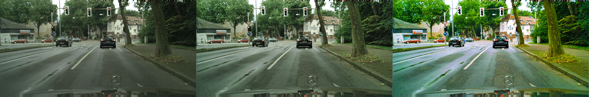
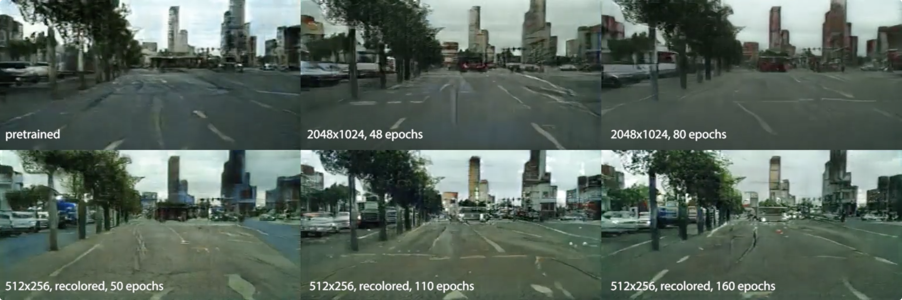

# Procedural City Generation

## Motivation

In order to use _pix2pix_ to translate a procedurally generated city into photo-realistic renderings of a city, we first need to generate a procedurally generated city. Observing that _pix2pix_ has decent ability to hallucinate details based on shapes, we designed our generative algorithms as follows.

## Techniques

### Types of Cities

We came up with two possible ways of procedurally generating a city. The first is a road-first method: first produce tree-fractal-like roads and then generate buildings along the roads. The second is a block-first method: Consider the whole map as a single large block, and recursively divide them into smaller blocks with roads. We decided to experiment with the latter for this project.

Our implementation first considers the city from a 2D perspective, similar to a (top-down) plan. Afterwards, shapes are extruded to render a 3D city.

### Splitting Blocks

Each city block can be viewed as a polygon, and the division of blocks using roads can be considered as drawing a poly-line that passes through it, yielding two smaller polygon blocks.

Roads in real cities are often curved, and blocks sometimes have irregular shapes. But instead of being completely random blobs, these structures are more comparable to rectangles and triangles with wiggly edges. To capture these important features, we decided to store the blocks as lists of "borders", with each border containing a list of points, and the roads as single borders. 

During the recursive division step, it is desirable that the blocks are split optimally, that is, number of sliver and tiny pieces shall be minimized. While more sophisticated algorithms exist (e.g. comparing perimeter to area), we decided to use an approximation which makes a cut passing through the mid-points of two longest borders of the block. It is observed that this gives both speed and nice variations.

### Paving roads

To reproduce the somewhat curved shape of roads in real life, we applied a Perlin Noise to offset points along a straight line. Different sampling give different "wiggliness".

### Planning Buildings

After the blocks are determined, they need to be further divided into smaller sections - buildings. A relatively simple algorithm is as follows: 

- First, a grid is laid upon the block of interest, with a random rotation. 
- Then, all the squares on the grid that lays outside the block are deleted. 
- Finally, the remaining squares are randomly combined to make larger rectangles, which represent the buildings. The maximum and minimum size of the buildings can be dependent on the size of the block.

### Building the City

Once the 2D plan of roads, buildings and blocks is obtained, a rough city model can be generated by extruding the shapes. The buildings near center of the map, which is probably downtown, are made skinnier and taller, and buildings near edge of the map, which is probably suburban area, are made larger and flatter. The roads that are generated by the first couple recursions are wider, representing the main streets, while roads generated by the last few recursions are much narrower, representing small paths and shortcuts.

Miscellaneous structures such as street lights, traffic lights, street signs are generated using groups of cubes with some variants, and are populated along the roads. Some simple logic determines their location and appearance.

### Growing Trees

While cubes are suffice for most stuff on the road, more organic structures such as trees requires more complicated meshes. So a procedural blob generator which applies some noise to the sphere function is written. Each vertex on the sphere is randomly offset from the center, with the magnitude determined by Perlin Noise with spatial information of the vertex as input. The tree is then composed of a bunch of these blobs.

The same blob method is also used to generate mesh for humans (one blob for head, one blob for body).

### Adding Life

Vehicles, people and other moving things are added to prevent the city from looking spooky and abandoned.

Some design of artificial intelligence is required for this to work: cars needs to know where the roads are (instead of drifting through buildings), and things shouldn't bump into each other (too often).

Complex traffic rules can be probably implemented, but for the sake of this project, We decided to condense them into a handful of most essential axioms:

- The ultimate goal of any entity is to reach a destination (i.e. a location on the map).
- At each time step, the entity can either move forward or backward along the road, or turn into another road if it's at a crossroad. The decision is informed by its desire to reach the destination.
- If two entities bump into each other, one of them will be stunned for a couple seconds (allowing the other to pass) and start moving again.
- Traffic keeps to the right.

The result is a (rather amusing) primitive form of traffic system. While many traffic accidents are effectively prevented, and vehicles and people generally get to go where they intend to go, traffic jams and serial car accidents occur frequently at busy crossroads. Sometimes they run into a Klotski puzzle situation, and the road becomes so blocked nobody can pass through, accumulating more and more stuck cars over time.

## Possible Improvements

While a relatively complete city can be generated using the methods described, We considered a couple of potential future improvements:

- Overpasses can be built to produce a more spectacular city;
- Make traffic lights actually functional;
- More terrain variants instead of just flat;
- More types of miscellaneous objects on the sidewalk. (e.g. carts, umbrellas, open air tables)
- More lanes for cars (instead of just 2 for every road)

# Pix2Pix Experimentation, Training and Testing
## Intro
We experimented with multiple methods and variables in the training and testing processes in order to understand a bit more how the pix2pix network thinks and works, and how we can get the best results from it. We discovered that rendering a single image well often did not mean it would translate the same level of quality into generating video frames. For our experimentations, we used both regular pix2pix-tensorflow and a lesser known pix2pixHD (which was even more finicky in it's own way).

### Color Correction
The original training set is based on footage from a mercedes being driven around in various German cities, resulting in a rather dim, downcast imageset. In an experiment to see how editing the footage to increase brightness, contrast and saturation would result in different pix2pix models, we processed the dataset twice and compared the original with two different levels of color correction.

After training a seperate model for a short period of time each (approx 40-50 epochs), we decided the most saturated image yielded far too fake of an image, almost an eye sore. The original dataset, which resulted in images that felt like Hong Kong, was still too gray and monotone for enjoyable results. The final models were trained on a dataset consisting of the middle image type, which is "some" color correction.

### Training Dataset Resolution
We compared models we trained on datasets consisting of a resolution of 512x256 pixels and the full size of 2048x1024 pixels, as well as compared with the pretrained model available on pix2pix's website. We couldn't decide between the two models we trained, in the end, and used both in our final renders. We did conclude that both our models were better than the pretrained model available online. Please note that our larger dataset consisted of unprocessed (original) images while the smaller dataset was based on our color corrected dataset. Some differences may have arised from that fact.

### Varying Iterations (epochs)
Somewhat due to the limited time available per session on our main choice of cloud computing platform, Google Colab, we saved checkpoints at various stages of training, most often at around 40-60 epochs per 11-hour training sessions. 

This resulted in the most confusion and discussion regarding what looked best. When originally comparing generated still images as tests, sometimes the lower-iterations resulted in more "realistic" renders, and other times higher iteration counts did. This flip-flop trend continued once we began generating images frame-by-frame and compiling videos. Although higher iteration checkpoints contained more detail, they seemed to flicker more often between frames compared to lower iteration checkpoints. Our final renders used the model trained on full size images for 80 epochs, and a model trained on smaller, color corrected images at 160 epochs.

### Flickering, Static Textures, Artifacts
While testing our renders we noticed that the higher the framerate, the more likely flickering would occur, as well as a phenomenon where a building's texture would remain still on the screen relative to frame edges, even while the camera moved or panned. By reducing the framerate, these effects seemed to minimize, so our final renders generally are set to 10fps. We also decided that, possibly in the future, by rendering buildings as seperate images and compiling them later we may achieve a more seperated, realistic render of buildings rather than one large gray blob on screen.

INSERT SHOUVIK'S TEST HERE

### Issues with Training

##### Local Training
We ran into multiple issues while training, often leading to loss of 12+ hours of training, multiple times. The first issue was that Mac's are no longer supported for GPU training, which means it's CPU only and highly inefficient. A MacBook Pro Retina 15" was used for 20 hours (two nights) and only got as far as 50 epochs in total.

##### Google Colab
Google Colab was our go-to training method afterwards because AWS wasn't working for some members, and because Colab is far easier to use and easy to colaborate with. Unfortunately, the problems continued where two 12-hour sessions were lost. The first time was lost because we were unable to extract our trained checkpoints, repeatedly running into connection errors while attempting to download it from the browser using `file.download(file)`, even when breaking down to small parts. (the second loss was due to wrong alarm clock setting, which passed the 12-hour time limit of Colab and the instance shut down).

Apparently, any direct uploading or downloading through the `file` library results in connection issues if it takes longer than a few seconds for the process to complete. The solution was to either use Google Drive or other online storage means to store datasets or previous checkpoints, and use PyDrive or python to download using those URLs directly to Colab. As for uploading upon training completion, the only way is directly uploading to Drive. Multiple Piazza posts were made about these issues.

An unexpected benefit to this is that transfering files between Colab instances and Drive is extremely fast, sometimes up to 8GB a minute! This must be due to the fact that they are both Google products and probably share Google servers.

##### pix2pixHD

@LINGDON YOU REFLECT HERE

